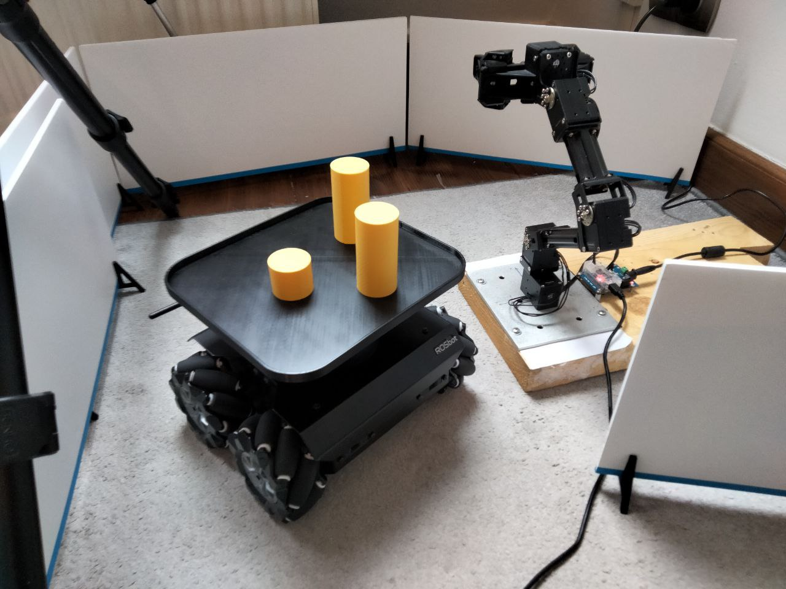
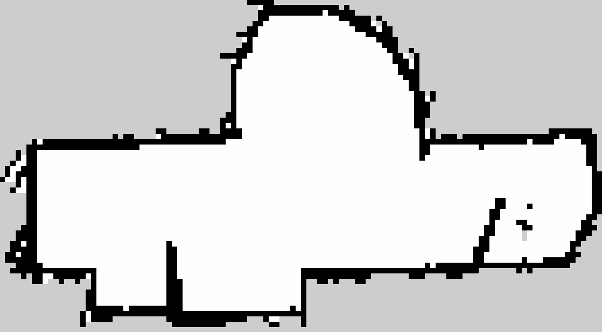

import YouTube from 'react-youtube';

export const opts = { 
  width: '100%',
  playerVars: {
    // https://developers.google.com/youtube/player_parameters
    autoplay: 0,
  },
};

## Abstract
In most of industrial cases, application of mobile and manipulation robots significantly speeds up and improves a given process.
Sometimes a combination of the advantages of transport robots and robotic arms is needed to acheive a given goal.
This project, based on ROS2, shows an example of cooperation between the ROSbot 2.0 PRO mobile robot and a stationary stand copmosed of the OpenMANIPULATOR-X robotic arm and the Intel Realsense D435 depth camera. The software layer cosists of 3 Python nodes (`/grabber_from_image_cords`, `/tracker` and `/rosbot_control`), which are discribed in [ROS Description](https://github.com/husarion/rosbot-manipulator-colaboration#ros-description) section. 


## Description
As said in the abstract above, this project is an application based on the cooperation of [ROSbot 2.0 PRO](https://store.husarion.com/products/rosbot-pro), [OpenMANIPULATOR-X](https://emanual.robotis.com/docs/en/platform/openmanipulator_x/overview/) and [Intel Realsense D435](https://www.intelrealsense.com/depth-camera-d435/).
ROSbot with a custom 3D printed [plate](https://github.com/husarion/rosbot-manipulator-colaboration/tree/master/CAD) transports [yellow cylinders](https://github.com/husarion/rosbot-manipulator-colaboration/tree/master/CAD) (more less with a diameter of 35 mm), which can be also 3D printed, from starting point to the manipulator's area. Above the robotic arm there is a Realsense depth camera which detects the cartesian position of objects and their height. The manipulator picks up the yellow elements one by one putting them on top of each other in a safe place called storage. Then, the empty ROSbot returns to its starting point and waits for new objects to be reloaded in order to start new sequence.

The final effect of this project can be seen in the video below.

#### Project Video

<YouTube videoId="ln8KBR5Wjo4" opts={opts} />

<!---
<div align="center">
<iframe width="1920" height="1080" src="https://www.youtube.com/watch?v=ln8KBR5Wjo4" frameborder="0" gesture="media" allowfullscreen></iframe>
</div>
-->

### Features and capabilities
* Whole system is Docker based 
* PC / laptop, manipualtor and camera communicate with the ROSbot in a Local Area Network (LAN) being in the same Wi-Fi network
* The project is based on autonomous mapping and navigation with ROSbot [Navigation2](https://navigation.ros.org/) and [Slam Toolbox](http://wiki.ros.org/slam_toolbox) in Docker
* Application launches Rviz2 software, which shows the visualization of the ROSbot's movement in the room
* Rviz2 also shows images from the camera: color image, depth image and markers on detected objects
* The color of detected objects depends on the HSV ranges set in the code
* System counts collected objects

### Dealing with parallax error

The camera image is a flat representation of the three-dimensional world. The position of an object in space (the posion of its base on the ground) is obtained from the position of its upper surface seen on the image. However, the further away the object is from the center of the image, the more visible it will be from the side. Due to the different height of the objects, its top will no longer reflect the position of its base.
In science, this effect has been called "parallax error" and its presense is often marked when reading measurements from analog pointer meters. To compensate it, it is enough to look at the meter directly from above.
In the case of this project, the camera is stationary, so a math workaround should be used. Knowing the height (h) of the objects and its distance from the center of the image in XY space (R), you can easily calculate (&delta;) its real position, getting rid of the parallax error:


### ROS Description
OpenMANIPULATOR launch file offers [a lot of services](https://emanual.robotis.com/docs/en/platform/openmanipulator_x/ros_controller_msg/#service). This project (specifically `/grabber_from_image_cords` node) uses some of these to control the manipulator: `/goal_task_space_path`, `/goal_joint_space_path`, `/goal_tool_control`.

The realsense node `/realsense2_camera_node` publishes [a lot of topics](https://github.com/IntelRealSense/realsense-ros/tree/ros2#published-topics). This project (specifically `/tracker` node) uses only two: `/color/image_raw` and `/depth/image_rect_raw`.

Rviz2 software shares the feature of publishing data about the point, clicked on the displayed map, on topic: `/clicked_point`. Node `rosbot_control` subscribes to that topic.

Also some custom ROS2 Topics were made:

Topic | Message type | Publisher node name | Description
--- | ---| --- | ---
`/target_on_image` | `Point` | `/tracker` | The camera checks for the presence of object(s) and then publishes their XYZ location.
`/output/color` | `Image` | `/tracker` | Color image from the camera with indication of the detected color
`/output/black` | `Image` | `/tracker` | Black image with circle(s) graphically highlighting the position(s) of the object(s)
`/output/depth` | `Image` | `/tracker` | Depth image from the camera
`/manip_finished` | `Bool` | `/tracker` | The camera checks if the manipulator finished picking object(s) and publishes True of False.
`/rosbot_arrived` | `Bool` | `rosbot_control` | The ROSbot publishes True upon arrival to the camera and manipulator. 

System schematic diagram:


\* More about topics published by ROSbot to rviz you can find [here](https://github.com/husarion/rosbot-docker#publishes).


## Launching the project

### 1. Hardware setup

Setup the hardware for example like on photo below. First, set up the tripod (or other similar equipment) with the depth camera pointing directly downwards. Then place the manipulator on a stable base on the ground. It is VERY IMPORTANT that the origin of the manipulator's coordinate system (middle of base of the first servo, [the first TF from the ground](https://emanual.robotis.com/assets/images/platform/openmanipulator_x/OpenManipulator_rviz.png)) is in the middle of the uppor border of the color image from the camera. It must be manually precisely set at a later stage of the project, immediately when the color image is displayed.




In addition, you can add some obstacles or build small maze:


### 2. Docker installation
Whole system runs on Docker and Docker-Compose to make it as easy and efficient as possible to launch on different devices.
Make sure you have [Docker and Docker-Compose](https://docs.docker.com/desktop/install/linux-install/) installed on your laptop.

> If you don't have, here's a quick summary for Ubuntu 20.04 (just click the `copy` button, and paste it to the Linux terminal):
> ```bash
> sudo apt-get update && sudo apt-get install -y ca-certificates curl gnupg lsb-release
> ```
> ```bash
> sudo mkdir -p /etc/apt/keyrings
> ```
> ```bash
> curl -fsSL https://download.docker.com/linux/ubuntu/gpg | sudo gpg --dearmor -o /etc/apt/keyrings/docker.gpg
> ```
> ```bash
> echo \
>  "deb [arch=$(dpkg --print-architecture) signed-by=/etc/apt/keyrings/docker.gpg] https://download.docker.com/linux/ubuntu \
>  $(lsb_release -cs) stable" | sudo tee /etc/apt/sources.list.d/docker.list > /dev/null
> ```
> ```bash
> sudo apt-get update && sudo apt-get install -y docker-ce docker-ce-cli containerd.io docker-compose-plugin
> ```
>
> Change `/var/run/docker.sock` permissions, so every user can can run docker commands without `sudo`:
> ```bash
> sudo chmod 666 /var/run/docker.sock
> ```

### 3. Connecting to ROSbot via ssh
ROSbot is basically a computer running Ubuntu, so plug in a display with HDMI, mause and keyboard into USB port in the rear panel of ROSbot. Proceed step by step with [Connecting ROSbot to your Wi-Fi network](https://husarion.com/manuals/rosbot/#connect-rosbot-to-your-wi-fi-network).
For example:
```bash
ssh husarion@192.168.8.191
```

### 4. Cloning GitHub repository

##### Both on PC and on ROSbot:

Create new foler and clone this repository:
```bash
mkdir rosbot_manipulator_colaboration
git clone https://github.com/husarion/rosbot-manipulator-colaboration.git rosbot_manipulator_colaboration
```

### 5. Hardcoded variables

> **Warning**
> To make project work properly, measure the vertical distance between the camera and the ground using for example the tape measure. The measured value in milimeters should be writeen into line 25 of:
> 
> `ros2_ws/src/open_cv_pkg/open_cv_pkg/tracker.py`
> ```ruby 
> 25      self.H_ = 700.0     # [mm] Hardcoded height of Realsense above the ground
> ```
> 
> And also the measured value in meters should be written into line 26 of:
> 
> `ros2_ws/src/open_manip/open_manip/grabber_from_image_cords.py`
> ```ruby
> 26      self.H_ = 0.70      # [m] hardcoded height of Realsense above the ground
> ```
> 
> Then measure the width of the field of view of the camera measured on the ground. Tha measured value in milimeters should be written into line 28 of:
> 
> `ros2_ws/src/open_manip/open_manip/grabber_from_image_cords.py`
> ```ruby
> 28      self.camera_width_in_mm_ = 710.0    # [mm] hardcoded width of camera view measured on the ground 
> ```

### 6. Preparing .env file

Navigate to `rosbot_manipulator_colaboration/docker_stuff_rosbot/` folder and open `.env` file with a favourite editor.

For example:
```bash
nano .env
```
Modify its content:
- set your own `ROS_DOMAIN_ID` (if modified, write the same in `rosbot_manipulator_colaboration/docker_stuff/.env`)
- set `SERIAL_PORT` depending on what ROSbot you are using
- set `RPLIDAR_BAUDRATE` depending on what RPlidar you are using

### 7. Flash the microcontroller 

To flash the right firmware, open ROSbot's terminal (e.g. [via ssh](https://github.com/husarion/rosbot-manipulator-colaboration#3-connecting-to-rosbot-via-ssh)) and execute this command:
   
- for differential drive (regular wheels):
   
```bash
docker run --rm -it --privileged \
husarion/rosbot:noetic \
/flash-firmware.py /root/firmware_diff.bin
```
- for omnidirectional wheeled ROSbot (mecanum wheels):

```bash
docker run --rm -it --privileged \
husarion/rosbot:noetic \
/flash-firmware.py /root/firmware_mecanum.bin
```

---


#### This project is divided into 2 stages: [mapping](https://github.com/husarion/rosbot-manipulator-colaboration#mapping) and [launching the main project](https://github.com/husarion/rosbot-manipulator-colaboration#launching-the-main-project).

## Mapping

First you need to map rooms and surroundings with ROSbot and [Slam Toolbox](http://wiki.ros.org/slam_toolbox). Then save the map.
All you need to do is place robot on starting point and:

:computer: on PC / laptop:

Navigate to `rosbot_manipulator_colaboration/docker_stuff/` folder and execute:
```bash
xhost local:root
docker compose -f compose.rviz.mapping.yaml -f compose.rviz.lan.yaml up
```
:robot: on ROSbot:

Navigate to `rosbot_manipulator_colaboration/docker_stuff_rosbot/` folder and execute:
```bash
docker compose -f compose.rosbot.hardware.yaml -f compose.rosbot.mapping.yaml -f compose.rosbot.lan.yaml up
```

> **Note** 💡
> 
> In order to use GUI of applications running in containers (like rviz), the `xhost local:root` command must be executed on your PC, before starting the containers
> ``` bash
> xhost local:root
> ```

Navigate in your room using `2D Goal Pose` on Rviz.
When map is finished open new terminal and again connect to ROSBot via ssh [like previously](https://github.com/husarion/rosbot-manipulator-colaboration#3-connecting-to-rosbot-via-ssh).
For example:
```bash
ssh husarion@192.168.8.191
```
Then navigate to `rosbot_manipulator_colaboration/docker_stuff_rosbot` folder and execute on ROSbot:
```bash
./map-save.sh
```
Your map is now saved in the 'maps/' folder!

Now transfer the maps folder to your laptop using for example [sftp](https://linuxize.com/post/how-to-use-linux-sftp-command-to-transfer-files/).
Open a new terminal and exetute (with your IP adress):
```bash
sftp husarion@192.168.8.191
```
Then execute:
```bash
cd rosbot_manipulator_colaboration/docker_stuff_rosbot/
lcd rosbot_manipulator_colaboration/docker_stuff_rosbot/
get -r maps/
```

Example result of the map:



Mapping phase is completed, you can stop / remove all running containers on ROSbot:
```bash
docker kill $(docker ps -q)
docker container prune
```

## Launching the main project

The main part of this project bases on the map just created and the localization [AMCL](https://navigation.ros.org/configuration/packages/configuring-amcl.html) tool.

##### Set your ROSbot on the starting point and put objects on its plate. 

:computer: on PC / laptop:

Navigate to `rosbot_manipulator_colaboration/docker_stuff/` folder and execute:
```bash
xhost local:root
docker compose -f compose.main.yaml -f compose.rviz.localization.yaml -f compose.rviz.lan.yaml up
```
:robot: on ROSbot:

Navigate to `rosbot_manipulator_colaboration/docker_stuff_rosbot/` folder and execute:
```bash
docker compose -f compose.rosbot.control.yaml -f compose.rosbot.hardware.yaml -f compose.rosbot.localization.yaml -f compose.rosbot.lan.yaml up
```

Now, using `Publish Point` on Rviz chose the starting point and the destination point on the loaded map. Everything should look like in previously linked video:

<div align="center">
<iframe width="???" height="???" src="https://www.youtube.com/watch?v=ln8KBR5Wjo4&t=270s" frameborder="0" gesture="media" allowfullscreen></iframe>
</div>

## Possible issues

### 1. No image from Realsense camera

Every time you stop and rester the project first you need to unplug and plug USB cable of Realsense.

### 2. Manipulator doesn't move (controller container exits with error code)

This may be coused by the wrong boudrate of the DYNAMIXEL servos.

There are two ways to solve this problem:

##### 1. Writing boudrate directly to your DYNAMIXEL servos
- Download the [DYNAMIXEL Wizard 2.0](https://emanual.robotis.com/docs/en/software/dynamixel/dynamixel_wizard2/) software and open it.
- Connect the USB cable of the OpenMANIPULATOR-X to your laptop/PC.
- Scan for the servos
- Change their [boudrate setting in the EEPROM Area](https://emanual.robotis.com/docs/en/dxl/x/xm430-w350/#baud-rate8) to value `2: 115200 [bps]`
##### 2. Modify boudrate value in compose file to default and hope for the best
Assuming no one has made changes to your servos before, their boudrate is set to the default (57600 [bps]).
Modify the line 17 of the `rosbot_manipulator_colaboration/docker_stuff/compose.main.yaml` file:

From:
```ruby
17      command: ros2 launch open_manipulator_x_controller open_manipulator_x_controller.launch.py baud_rate:=115200  # baud_rate:=1000000 or 115200 or none (default 57600)
```
To:
```ruby
17      command: ros2 launch open_manipulator_x_controller open_manipulator_x_controller.launch.py  # baud_rate:=1000000 or 115200 or none (default 57600)
```

### 3. Manipulator doesn't move (controller container runs properly)

There are [some positions](https://github.com/ROBOTIS-GIT/open_manipulator/pull/46) of robotic arm which exceed its joint's limits.
Try to launch project with the initial pose like this:


